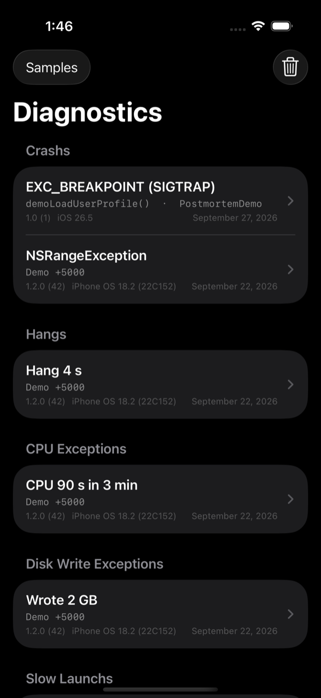
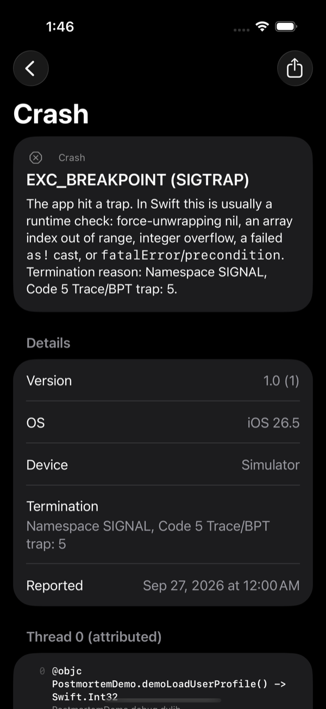
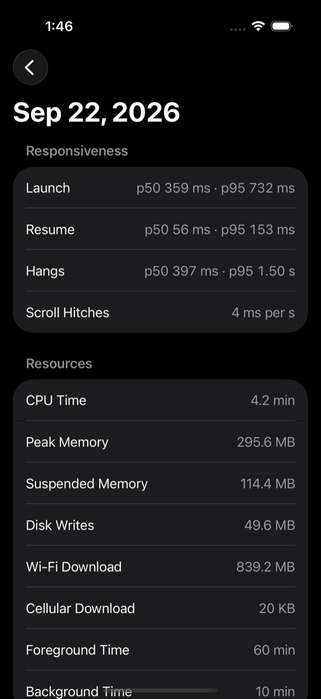

# Postmortem

[](https://github.com/CreatureSurvive/Postmortem/actions/workflows/ci.yml)
[](https://swift.org)
[](#requirements)
[](#installation)
[](LICENSE)

Crash, hang and performance reports from MetricKit, readable on the device, with no third-party
service. It stores every payload, explains each crash in plain language, symbolicates stacks on
device, and includes a SwiftUI viewer for your debug menu.

```swift
import Postmortem

@main
struct MyApp: App {
    init() { PostmortemCollector.shared.start() }

    var body: some Scene {
        WindowGroup {
            ContentView()
        }
    }
}

// In a debug or settings screen:
NavigationLink("Diagnostics") { PostmortemView() }
```

<p align="center">
  
  &nbsp;
  
  &nbsp;
  
</p>


## Why

MetricKit collects crashes, hangs, CPU and disk-write exceptions, slow launches and daily
performance metrics on real users' devices, for free. Almost nobody uses it directly, because:

- It delivers raw JSON: stack trees of binary UUIDs and offsets, measurements as strings like
  `"2500 ms"`, and Mach exception numbers.
- Each payload is delivered once. If you don't store it, it's gone.
- Nothing symbolicates or explains it. `exceptionType: 6, signal: 5` means "a Swift runtime
  trap", but you have to know that.

The new typed MetricKit API (`MetricManager`, `CallStackTree`) requires iOS 27 or macOS 27.
Postmortem works back to iOS 17 and adds the storage, symbolication and UI that MetricKit
doesn't provide on any version.

## Features

- **`PostmortemCollector`:** subscribes to MetricKit and imports `pastDiagnosticPayloads` and
  `pastPayloads`, so reports delivered before you adopted it aren't lost. It has an `onReceive`
  hook for uploading.
- **`ReportStore`:** keeps the raw JSON, so nothing is lost if parsing improves later. It
  deduplicates identical payloads and diagnostics re-delivered in later payloads, trims by age
  and count, and publishes changes.
- **Typed models:**
  - `DiagnosticPayload` and `Diagnostic` for crashes, hangs, CPU exceptions, disk write
    exceptions and slow launches, with all metadata. Unknown keys are kept in `extra`.
  - `MetricPayload` for CPU, memory, launch, resume and hang histograms (with percentile
    estimates), hitch ratios, disk, network, and exit reasons.
- **`CrashExplanation`:** turns exception types, signals, termination reasons and Objective-C
  exceptions into a title and a plain-language summary. It also knows common termination codes:
  `0x8badf00d` watchdog, `0xdead10cc` lock held in the background, thermal kills, and others.
- **`Symbolicator`:** resolves frames on device when the binary is loaded: the same app build,
  or system libraries on the same OS version.
  - System libraries resolve through `dladdr`.
  - Your own binaries resolve through their in-memory symbol table, so Debug and
    unstripped builds show real function names, including private Swift functions.
  - Swift names are demangled.
- **`DiagnosticReport`:**
  - `text(for:)` produces a shareable report in the style of Apple's crash logs.
  - `atosScript(for:)` produces a shell script that symbolicates stripped Release builds with
    your dSYMs, checking each dSYM's UUID first.
- **SwiftUI:**
  - `PostmortemView` lists everything grouped by kind.
  - `DiagnosticDetailView` shows the summary, metadata and symbolicated threads, with sharing.
  - `MetricDetailView` shows p50 and p95 launch, resume and hang times, resource use and exit
    reasons.
- **Robust parsing:** Foundation's JSON parser gives up at 512 levels of nesting. MetricKit
  nests every frame two levels inside its caller, so a crash of more than about 250 frames (for
  example, runaway recursion) wouldn't parse at all. Postmortem parses and builds stack trees
  without recursion, and deep trees are compared, hashed and freed with loops, so they're safe
  on small background-thread stacks. Malformed input is fuzzed in the tests.

## Details

```swift
let diagnostics = try await ReportStore.shared.diagnostics()
for crash in diagnostics where crash.kind == .crash {
    print(crash.title)    // "EXC_BAD_ACCESS (SIGSEGV)"
    print(crash.summary)  // "The app accessed memory it doesn't own, …"
    let frames = Symbolicator().symbolicate(crash.primaryFrames)
    print(frames.map(\.description).joined(separator: "\n"))
}

let metrics = try await ReportStore.shared.metrics()
if let launch = metrics.first?.launchTime {
    print("p95 launch:", launch.percentile(0.95) ?? 0, "s")
}
```

Upload payloads as they arrive:

```swift
PostmortemCollector.shared.onReceive = { kind, json in
    Task { try await uploader.send(json, kind: kind.rawValue) }
}
```

## Installation

Add Postmortem to your `Package.swift`:

```swift
dependencies: [
    .package(url: "https://github.com/CreatureSurvive/Postmortem.git", from: "1.0.0"),
],
targets: [
    .target(name: "MyApp", dependencies: ["Postmortem"]),
]
```

Or in Xcode, choose **File › Add Package Dependencies…** and enter
`https://github.com/CreatureSurvive/Postmortem`.

### Requirements

| Platform | Minimum |
| --- | --- |
| iOS | 17.0 |
| macOS | 14.0 |
| tvOS | 17.0 |
| watchOS | 10.0 |
| visionOS | 1.0 |

Swift 6.1 (Xcode 16.4) or later, in Swift 6 language mode. No third-party dependencies.

Collecting reports needs MetricKit, so it runs on iOS, macOS and visionOS. The models and store
also build on tvOS and watchOS, and the viewers on tvOS, so a tvOS app can show reports gathered
elsewhere and a companion app can parse uploaded payloads.

## Testing

`swift test` runs 35 tests. They cover:

- **Fixtures:** in `Tests/PostmortemTests/Fixtures`, generated by MetricKit itself. Scratch
  tools in `Tools/` build real `MXDiagnosticPayload` and `MXMetricPayload` objects through
  MetricKit's own initializers and let Apple's code serialize them, so the parser is tested
  against Apple's actual JSON layout.
- **Crash explanations** and **measurement parsing**, with and without grouping separators.
- **Histogram percentiles**.
- **The JSON parser:** equivalence with Foundation, invalid input, 1,000-frame stacks, and
  fuzzing.
- **Deep stacks on small threads:** a 4,096-frame crash parsed, compared, hashed and freed on a
  thread with a 256 KB stack.
- **Live symbolication:** an exported C function, a local Swift closure found through the symbol
  table, and a shared-cache system function, all resolved in the test process.
- **The store:** deduplication, retention and change notifications.

`Example/` is an iOS app with a UI test. It loads the fixtures plus a live crash whose frames
point into the running app and UIKit, and checks that the viewer lists every kind, resolves
`demoLoadUserProfile` and `UIApplicationMain` on device, and shows metrics.

```sh
cd Example && xcodegen generate
xcodebuild test -project PostmortemDemo.xcodeproj -scheme PostmortemDemo \
  -destination "platform=iOS Simulator,name=iPhone 16"
```

The README screenshots are captured by UI tests in `Example/`; `Scripts/screenshots.sh` regenerates them.

## Limitations

- MetricKit delivers reports roughly once a day, and only on physical devices. In Xcode, use
  **Debug > Simulate MetricKit Payloads** on a connected device to test delivery.
- **Symbolicating Release app code:** App Store and TestFlight builds are stripped, so their
  frames resolve only to exported symbols on device. Use the `atos` script with your dSYMs.
- **System frames from other OS versions:** frames from a different OS version than the one
  running can't be resolved on device.
- **Event times:** MetricKit reports only the period a diagnostic was delivered in, not the
  exact time of the event.

## Changelog

See [CHANGELOG.md](CHANGELOG.md). Releases follow [Semantic Versioning](https://semver.org).

## Contributing

Issues and pull requests are welcome. Please run `swift test` before opening a pull request, and
add tests for new behavior.

## License

Available under the MIT license. See [LICENSE](LICENSE) for details.
